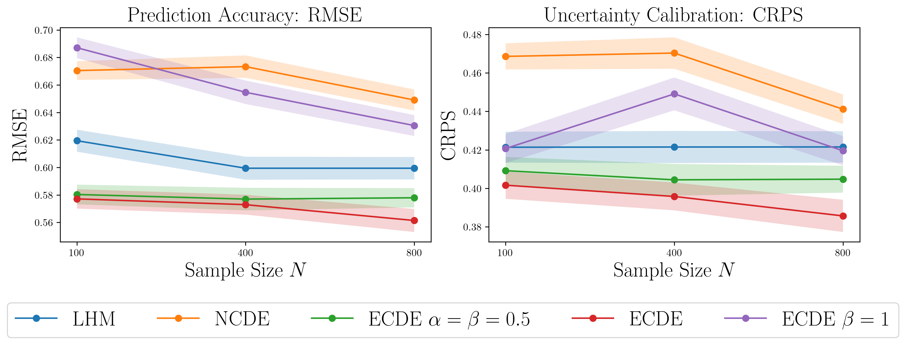

# Expert Controlled Neural Differential Equations: Disease Progression Modelling  

Code for *Expert Controlled Neural Differential Equations: Disease Progression Modelling*, mini-project for the van der Schaar Lab.  

> **Abstract:** Incorporating expert knowledge into machine learning models has achieved suc-
cesses in various scientific domains. In particular, in pharmacology, the Latent
Hybridisation Model (LHM) has exhibited remarkable predictive performance on
real-world intensive care data of COVID-19 patients. However, its assumption
about the expert model being self-contained might be restrictive in certain sce-
narios. To remedy this, we propose a principled method using ideas from neural
controlled differential equations, which enjoy well-developed mathematical founda-
tions. We provide an alternative way to leverage expert knowledge and demonstrate
competitive predictive performance of our model on simulated datasets.

<!-- figure   -->

  

The main implementation can be found in `new_models_cde.py`. The implementation for incorporating infinitely deep BNN can be found in `new_models_hybrid.py`. 

Our code is based on [Hybrid-ODE-NeurIPS-2021](https://github.com/vanderschaarlab/Hybrid-ODE-NeurIPS-2021) and the BNN part is based on [Infinitely Deep Bayesian Neural Networks with SDEs](https://github.com/xwinxu/bayeSDE). 

We also remark that the results may vary from run to run due to the randomness in training and evaluation.